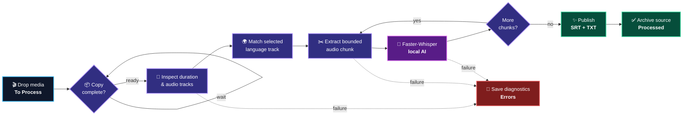

<a id="top"></a>

<p align="center">
  
</p>

<h1 align="center">LanguageAwareSubtitleExtractor</h1>

<p align="center">
  <a href="#-quick-start"></a>
  <a href="#-how-the-intelligence-flows"></a>
  <a href="#-privacy-by-design"></a>
</p>

<p align="center">
  <a href="https://www.python.org/downloads/"></a>
  <a href="https://github.com/SYSTRAN/faster-whisper"></a>
  <a href="https://ffmpeg.org/"></a>
  <a href="LICENSE"></a>
  
</p>

<h3 align="center">
  Drop in media. Choose a language. Receive production-ready subtitles.
</h3>

<p align="center">
  A resilient, self-configuring transcription pipeline that turns common audio and
  video into synchronized <code>.srt</code> subtitles and clean <code>.txt</code>
  transcripts—all on your machine.
</p>

<p align="center">
  <a href="#-why-this-project">Why</a> •
  <a href="#-experience-layer">Features</a> •
  <a href="#-how-the-intelligence-flows">Flow</a> •
  <a href="#-quick-start">Quick start</a> •
  <a href="#-supported-media">Media</a> •
  <a href="#-troubleshooting">Help</a>
</p>

<br />

## ✨ Why this project?

Long recordings should not require manual codec conversion, fragile command-line
pipelines, or constant supervision. LanguageAwareSubtitleExtractor provides a
single interactive Python entry point that prepares its own runtime, watches a
folder for media, and processes each file locally.

<table>
  <tr>
    <td width="33%" align="center">
      <h3>⚡ Zero friction</h3>
      <p>Detects and installs its Python and FFmpeg runtime dependencies automatically.</p>
    </td>
    <td width="33%" align="center">
      <h3>🌍 Language aware</h3>
      <p>Separates interface language, spoken language, and audio-track selection.</p>
    </td>
    <td width="33%" align="center">
      <h3>♾️ Long-form ready</h3>
      <p>Processes bounded chunks instead of loading an entire multi-hour file into memory.</p>
    </td>
  </tr>
</table>

## 🎛️ Experience layer

<table>
  <tr>
    <td width="50%" valign="top">
      <h3>🧠 Intelligent transcription</h3>
      <ul>
        <li>Local Faster-Whisper inference</li>
        <li>20 widely spoken source languages</li>
        <li>Metadata-aware audio-track matching</li>
        <li>GPU acceleration with CPU fallback</li>
      </ul>
    </td>
    <td width="50%" valign="top">
      <h3>🛡️ Resilient by design</h3>
      <ul>
        <li>Bounded 20-minute processing chunks</li>
        <li>Copy-completion detection</li>
        <li>FFmpeg inactivity protection</li>
        <li>Atomic outputs and diagnostic logs</li>
      </ul>
    </td>
  </tr>
  <tr>
    <td width="50%" valign="top">
      <h3>🎛️ Human-friendly control</h3>
      <ul>
        <li>English, Portuguese, and Spanish UI</li>
        <li>Remembered language preferences</li>
        <li>Live extraction and transcription progress</li>
        <li>Simple watched-folder workflow</li>
      </ul>
    </td>
    <td width="50%" valign="top">
      <h3>🎬 Production-ready output</h3>
      <ul>
        <li>Standards-compliant <code>.srt</code> subtitles</li>
        <li>Clean <code>.txt</code> transcripts</li>
        <li>Duplicate-safe filenames</li>
        <li>Automatic Processed and Errors routing</li>
      </ul>
    </td>
  </tr>
</table>

## 🧬 How the intelligence flows

<p align="center">
  <sub>One local pipeline—from raw media to timestamped language intelligence.</sub>
</p>



Each media file follows this pipeline:

1. The watcher waits until file size and modification time stop changing.
2. PyAV inspects the duration and available audio streams.
3. A stream tagged with the selected language is preferred; otherwise, the first
   audio stream is used.
4. FFmpeg extracts one 20-minute, 16 kHz mono audio chunk at a time.
5. Faster-Whisper transcribes the chunk in the selected spoken language.
6. Timestamps are shifted to their correct position in the complete recording.
7. Partial outputs are atomically promoted only after the full job succeeds.

This architecture bounds temporary storage and memory use, gives continuous
progress feedback, and prevents unread subprocess pipes from deadlocking long jobs.

## 🔧 Requirements

- Python **3.9 or newer**
- Internet access on the first run to download dependencies and the speech model
- Enough free disk space for one temporary audio chunk
- Windows, Linux, or macOS

An NVIDIA GPU is optional. When a compatible CUDA environment is detected, the
application uses it; otherwise, transcription continues on the CPU with INT8
inference.

> [!NOTE]
> **Smart first run:** the first transcription downloads the Faster-Whisper `small`
> multilingual model. Later launches reuse the local cache and start immediately.

## 🚀 Quick start

<table>
  <tr>
    <td align="center" width="33%">
      <h1>①</h1>
      <b>Get the project</b><br/>
      <sub>Clone or download the repository.</sub>
    </td>
    <td align="center" width="33%">
      <h1>②</h1>
      <b>Launch the script</b><br/>
      <sub>Dependencies configure themselves.</sub>
    </td>
    <td align="center" width="33%">
      <h1>③</h1>
      <b>Drop in media</b><br/>
      <sub>Watch subtitles appear in Output.</sub>
    </td>
  </tr>
</table>

### Launch

Windows PowerShell:

```powershell
python .\LanguageAwareSubtitleExtractor.py
```

Linux or macOS:

```bash
python3 ./LanguageAwareSubtitleExtractor.py
```

No separate `pip install` or FFmpeg installation is normally required. At startup,
the script checks for `av`, `faster-whisper`, `imageio-ffmpeg`, and `tqdm`, then
installs anything missing into the active Python environment.

### Configure and monitor

From the main menu:

1. Select the menu language if needed.
2. Select the original spoken language of the media.
3. Choose **Start monitoring and processing**.
4. Copy audio or video files into the displayed `To Process` folder.
5. Press <kbd>Ctrl</kbd> + <kbd>C</kbd> to stop monitoring and return to the menu.

Preferences are saved automatically and restored on the next launch.

## 📁 Working folders

The application creates its working structure in the same directory as
`LanguageAwareSubtitleExtractor.py`:

```text
LanguageAwareSubtitleExtractor/
├── LanguageAwareSubtitleExtractor.py
├── To Process/    # Drop new media here
├── Output/        # Completed .srt and .txt files
├── Processed/     # Successfully processed source media
├── Errors/        # Failed media and .error.log diagnostics
├── Temporary/     # Short-lived audio chunks and partial outputs
└── settings.json  # Saved menu and language preferences
```

To use a different root, set the `LASX_HOME` environment variable before launching:

```powershell
$env:LASX_HOME = "D:\My Subtitle Workspace"
python .\LanguageAwareSubtitleExtractor.py
```

```bash
LASX_HOME="$HOME/my-subtitle-workspace" python3 ./LanguageAwareSubtitleExtractor.py
```

## 🎞️ Supported media

The watcher does not rely on a short extension allowlist. It attempts any regular
file placed in `To Process`, using the codecs available in the packaged FFmpeg
build. Common examples include:

- Video: MP4, MKV, MOV, AVI, WebM, MPEG, M4V, FLV, and WMV
- Audio: MP3, WAV, FLAC, AAC, M4A, OGG, Opus, WMA, and AIFF

Files with no readable audio stream are moved to `Errors` with a diagnostic log.

## 🌐 Languages

The spoken-language selector includes English, Mandarin Chinese, Hindi, Spanish,
French, Arabic, Bengali, Portuguese, Russian, Urdu, Indonesian, German, Japanese,
Punjabi, Marathi, Telugu, Turkish, Tamil, Vietnamese, and Korean.

<p align="center">
  
  
  
  
  
  
  
</p>

Language selection affects two stages:

- **Track selection:** matching two- or three-letter metadata tags are preferred.
- **Recognition:** the corresponding Whisper language code guides transcription.

If a container has no useful language metadata, the app clearly reports that it is
using the first audio track while still transcribing in the selected language.

## 📦 Output behavior

For an input named `interview.mkv`, successful processing creates:

<table>
  <tr>
    <th>Input</th>
    <th>AI processing</th>
    <th>Outputs</th>
  </tr>
  <tr>
    <td align="center"><code>interview.mkv</code></td>
    <td align="center">Audio extraction<br/>＋<br/>Language-aware transcription</td>
    <td>
      <code>Output/interview.srt</code><br/>
      <code>Output/interview.txt</code><br/>
      <code>Processed/interview.mkv</code>
    </td>
  </tr>
</table>

Existing outputs are never silently overwritten. A timestamped suffix is added when
necessary. If processing fails, incomplete subtitle files are deleted and a detailed
`.error.log` is written beside the media in `Errors`.

## 🔐 Privacy by design

Media decoding and transcription run locally on your machine. Source audio is not
uploaded to a transcription service. Network access is used only to install Python
packages and download the selected open-source model when it is not already cached.

The default `small` multilingual model offers a practical balance between speed,
memory use, and recognition quality. Performance depends on media duration,
hardware, language, and recording clarity.

## 🩺 Troubleshooting

<details>
<summary><strong>The first launch takes a while</strong></summary>

The application may be installing binary Python packages. The first transcription
also downloads the AI model. Both are one-time operations for the current Python
environment and model cache.

</details>

<details>
<summary><strong>Transcription uses the CPU</strong></summary>

GPU processing requires a supported NVIDIA GPU and a CUDA environment compatible
with CTranslate2. If GPU initialization or inference fails, the application
intentionally retries on CPU instead of abandoning the file.

</details>

<details>
<summary><strong>The wrong audio track was selected</strong></summary>

Select the spoken language before monitoring. If the media container does not label
its tracks correctly, remux the file with accurate language metadata or make the
desired track the first audio stream.

</details>

<details>
<summary><strong>A file was moved to Errors</strong></summary>

Open the matching `.error.log` in the `Errors` folder. It contains the original
exception and traceback needed to diagnose unsupported, damaged, or inaccessible
media.

</details>

## 🗂️ Project structure

```text
LanguageAwareSubtitleExtractor.py  # Application and entry point
README.md                          # Documentation
LICENSE                            # MIT license
.gitignore                         # Python and runtime exclusions
```

## 🤝 Contributing

Issues and pull requests are welcome. Keep changes focused, preserve the local-first
privacy model, and verify behavior on both short and long media where possible.
When reporting a processing failure, include the generated error log after removing
any private paths or media details.

## 📄 License

Distributed under the [MIT License](LICENSE).

<br />

<p align="center">
  <b>Built for long-form media, multilingual voices, and dependable local AI.</b>
  <br/>
  <sub>From sound to meaning—privately, reliably, locally.</sub>
</p>

<p align="center">
  <a href="#top">Back to top ↑</a>
</p>


